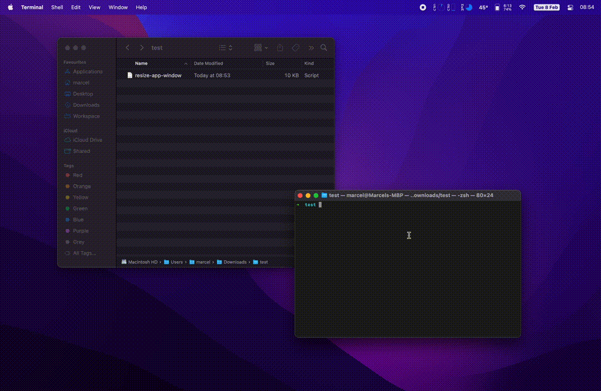

# Resize MacOS window app to 16x9 aspect ratio

> MacOS script to resize any App window to a 16:9 aspect ratio.

This script can be executed with the next terminal command:

```shell
osascript resize-app-window.scpt
```

A system dialog will be shown with your available applications, and it will resize the selected ones to the maximum 16x9 available size on your screen.


